# 📱 Sontine Mobile App

> **Tontine Meets Blockchain** - A React Native mobile application for decentralized rotating savings groups built on Solana blockchain.

## 🎯 Overview

Sontine Mobile App is a comprehensive mobile solution that brings traditional tontine (rotating savings) groups to the blockchain. Built with React Native and Expo, it provides a modern, secure, and user-friendly interface for managing tontine groups on the Solana network.

## 🏗️ Architecture & Design System

### **🎨 Brand Identity**

- **Primary Color**: `#00B49F` (Teal)
- **Secondary Color**: `#14F1B2` (Bright Teal)
- **Accent Color**: `#134158` (Navy Blue)
- **Typography**: Pixeloid Sans (custom pixel font)
- **Theme**: Material Design 3 with Sontine branding

### **📱 Navigation Architecture**

#### **Sontine Mobile App Navigation Architecture**


## 📂 Project Structure


## 🎯 Core Features

### **🏠 Home Tab - Dashboard**

- **Overview Cards**: Active tontines, total contributed, next payout, pending contributions
- **Quick Actions**: Browse tontines, create group, access wallet
- **Activity Feed**: Recent transactions, group updates, notifications
- **Reputation Display**: User score with star rating system
- **Notifications**: Bidding alerts, contribution reminders, payout notifications

### **💰 Tontines Tab - Core Functionality**

- **My Tontines Management**:
  - Active groups with contribution status
  - Pending applications
  - Completed tontines history
  - Progress tracking with visual indicators
- **Browse & Discovery**:
  - Search and filter available tontines
  - Group details with member profiles
  - Application process with requirements
- **Create New Tontines**:
  - Multi-step creation wizard
  - Smart contract deployment
  - Member invitation system
  - Financial configuration

### **👤 Profile Tab - Account Management**

- **Wallet Integration**:
  - SOL balance display
  - Send/receive functionality
  - Transaction history
- **Reputation System**:
  - Score calculation and display
  - Achievement badges
  - Performance metrics
- **Settings & Preferences**:
  - Notification preferences
  - Security settings
  - App configuration

## 🧩 Component Architecture


### **Component Details**

- **SontineButton**: 5 variants (primary, secondary, outline, ghost, gradient)
- **SontineCard**: 4 variants (default, elevated, outlined, gradient)
- **SontineInput**: Styled input with validation and helper text
- **GradientBackground**: 4 gradient variants for branding
- **TontineCard**: Rich card displaying tontine information
- **OverviewCards**: Dashboard summary widgets
- **ActivityFeed**: Transaction and update timeline
- **ReputationDisplay**: User score visualization

## 🎨 Design Specifications

### **Color Palette**

```typescript
const SontineColors = {
  primary: '#00B49F', // Main teal
  primaryLight: '#14F1B2', // Bright teal
  primaryDark: '#134158', // Navy blue
  surface: '#FFFFFF', // Clean white
  surfaceVariant: '#C5FFF8', // Light mint
  background: '#F8FFFE', // Very light mint
}
```

### **Spacing System**

```typescript
const spacing = {
  xs: 4, // Tight spacing
  sm: 8, // Small spacing
  md: 16, // Medium spacing
  lg: 24, // Large spacing
  xl: 32, // Extra large spacing
  xxl: 48, // Extra extra large spacing
}
```

### **Typography Scale**

- **headlineLarge**: 32px, Bold
- **titleLarge**: 24px, Bold
- **titleMedium**: 20px, Bold
- **bodyLarge**: 16px, Regular
- **bodyMedium**: 14px, Regular
- **bodySmall**: 12px, Regular

## 🔧 Technical Stack

### **Core Technologies**

- **React Native**: 0.79.5
- **Expo SDK**: 53
- **TypeScript**: Strict mode enabled
- **Expo Router**: File-based navigation

### **UI Framework**

- **React Native Paper**: Material Design 3 components
- **Expo Linear Gradient**: Gradient backgrounds
- **React Native SVG**: Vector graphics

### **Solana Integration**

- **@solana/web3.js**: Solana JavaScript SDK
- **@solana-mobile/mobile-wallet-adapter-protocol**: Mobile wallet integration
- **@solana/spl-token**: SPL token support

### **State Management**

- **@tanstack/react-query**: Server state management
- **React Context**: Local state management

## 🚀 Development Setup

### **Prerequisites**

- Node.js 18+
- Bun package manager
- Expo CLI
- iOS Simulator / Android Emulator

### **Installation**

```bash
# Install dependencies
bun install

# Start development server
bun start

# Run on specific platform
bun ios      # iOS Simulator
bun android  # Android Emulator
bun web      # Web browser
```

### **Available Scripts**

```bash
bun dev          # Start Expo development server
bun build        # Build for production
bun lint         # Run ESLint
bun type-check   # TypeScript type checking
```

## 📱 User Experience Flow

### **Authentication Flow**


### **Tontine Participation Flow**


### **Tontine Creation Flow**

```mermaid
stateDiagram-v2
    [*] --> Setup: Create New Tontine
    Setup --> Configuration: Set Parameters
    Configuration --> Review: Validate Settings
    Review --> Deploy: Deploy Smart Contract
    Deploy --> Invitation: Invite Members
    Invitation --> Management: Monitor Progress
    Management --> Completion: Tontine Ends
    Completion --> [*]

    Setup: 📝 Basic Information
    Configuration: ⚙️ Financial Settings
    Review: 👀 Review & Confirm
    Deploy: 🚀 Blockchain Deployment
    Invitation: 👥 Member Management
    Management: 📊 Active Monitoring
    Completion: 🏆 Final Settlement
```



## 🔐 Security & Trust

### **Wallet Security**

- Mobile Wallet Adapter Protocol integration
- Secure transaction signing
- Biometric authentication support

### **Reputation System**

- On-chain reputation tracking
- Performance-based scoring
- Community feedback integration

### **Smart Contract Integration**

- Automated contribution collection
- Transparent payout distribution
- Dispute resolution mechanisms

## 🎯 Future Enhancements

### **Phase 1: Core Features** ✅

- Basic navigation and UI components
- Tontine management interface
- Wallet integration
- Reputation system

### **Phase 2: Advanced Features** 🚧

- Real-time notifications
- Advanced bidding mechanisms
- Multi-token support
- Social features

### **Phase 3: Ecosystem** 📋

- DeFi integrations
- Cross-chain support
- Governance features
- Analytics dashboard

## 📊 Performance Metrics

### **Target Metrics**

- **App Launch Time**: < 3 seconds
- **Screen Transition**: < 300ms
- **Transaction Confirmation**: < 5 seconds
- **Offline Support**: Basic functionality available

### **User Experience Goals**

- **Intuitive Navigation**: < 3 taps to any feature
- **Clear Information**: All data easily scannable
- **Responsive Design**: Works on all screen sizes
- **Accessibility**: WCAG 2.1 AA compliance

## 🤝 Contributing

### **Development Guidelines**

1. Follow TypeScript strict mode
2. Use existing UI components when possible
3. Maintain consistent naming conventions
4. Write comprehensive tests
5. Document new features

### **Code Style**

- ESLint configuration enforced
- Prettier for code formatting
- Conventional commits for git history

## 📄 License

This project is part of the Sontine ecosystem and follows the main project's licensing terms.

---

**Built with ❤️ by the Sontine Team**
